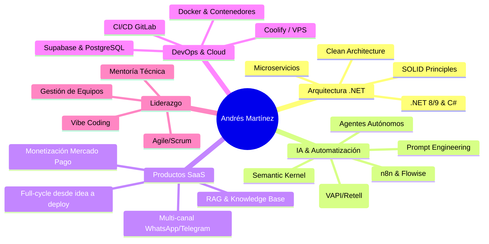

# 👋 Hola, soy Andrés Martínez

<div align="center">
  <a href="https://git.io/typing-svg">
    
  </a>
</div>

<p align="center">
  <a href="https://andresmmartinez.com" target="_blank">
    
  </a>
  <a href="mailto:andres.martinez.g@gmail.com" target="_blank">
    
  </a>
  <a href="https://www.linkedin.com/in/andres-m-martinez-g" target="_blank">
    
  </a>
  <a href="https://github.com/Andres-MMG" target="_blank">
    
  </a>
</p>

---

## 🚀 Sobre Mí

```typescript
const andres = {
  nombre: "Andrés Martínez Gajardo",
  ubicación: "Santiago, Chile 🇨🇱",
  rol: "Founding Software Architect / AI Solutions Lead",
  empresa: "M&L AI SpA — Consultoría & I+D en IA",
  experiencia: "20+ años en .NET Ecosystem + IA Generativa",
  nicho: "El puente entre Ingeniería de Software clásica y la IA Generativa",
  habilidadesClave: [
    "Clean Architecture, SOLID, Microservicios (.NET 8/9)",
    "Agentes de IA: LLMs, n8n, Flowise, RAG",
    "Voice AI: VAPI, Retell.ai, ElevenLabs",
    "Cloud-native: Docker, Coolify, CI/CD, VPS",
    "Bases de Datos: PostgreSQL, Supabase, Redis, SQL Server",
    "Frontend: React, TypeScript, Tailwind CSS, Blazor WebAssembly"
  ],
  pasiones: ["Clean Architecture", "Innovación en IA", "Mentoría Técnica", "Vibe Coding", "SaaS Products"]
};
```

Soy un **Arquitecto de Software Senior** con más de 20 años de experiencia liderando proyectos críticos
en la banca y otras industrias. Fundé **M&L AI SpA** como estructura de consultoría e I+D donde desarrollo
productos SaaS que combinan arquitecturas empresariales robustas con agentes de IA de vanguardia.

Soy el **puente entre el mundo .NET Enterprise y la IA Generativa**: domino desde Clean Architecture
y microservicios hasta orquestación de LLMs, agentes de voz y despliegues cloud-native. Me apasiona
impulsar la adopción de buenas prácticas y evangelizar tecnologías emergentes.

---

## 💼 Experiencia Profesional

### 🔥 M\&L AI SpA — *Founding Software Architect / AI Solutions Lead*

*Ago 2024 – Presente* | Santiago, Chile

* 🏗️ **Arquitectura**: Diseño e implementación de sistemas SaaS completos — desde modelo de datos hasta despliegue cloud-native con Docker y Coolify.
* 🤖 **Agentes de IA**: Recepcionistas virtuales, asistentes de agenda, agentes inmobiliarios, médicos y contables.
* ⚡ **Microservicios**: Integración .NET C# y Python con frontend en React/TypeScript; APIs REST.
* 📦 **Voice AI Stack**: Retell.ai, VAPI, Zadarma, ElevenLabs.
* 🔗 **Automatización**: n8n, Flowise, Evolution API (WhatsApp/Telegram), Chatwoot; prompt engineering y .NET Semantic Kernel.
* 💰 **Productos SaaS**: Inteliai.cl, LectorAI.cl, RestauratuFoto.cl — ciclo completo desde idea hasta monetización con Mercado Pago.

### 🏦 Sermaluc — *Ingeniero de Software / Jefe de Proyectos TI*

*Nov 2010 – Jul 2024* | Santiago, Chile

* 💻 **Banco Central**: Lideré desarrollo de la "App Regional" con .NET y Blazor WebAssembly; prototipo en .NET MAUI para estadísticas en tiempo real.
* 💳 **Banco Itaú**: Diseño e implementación de APIs REST para automatización de procesos bancarios y flujos Murex.
* 🏛️ **BancoEstado**: Proyectos críticos como Venta Crédito Hipotecario (VCH), Seguros FIDENS, Digitalización de Imágenes y Carpeta Electrónica Cliente.
* 🛠️ **DevOps**: Promoví CI/CD con GitLab, contenedorización Docker y despliegues escalables.

### Otras Experiencias Relevantes

*1998 – 2010* | Santiago, Chile

* **Newsystems Ltda.** (2001–2007): Desarrollo y mantenimiento de plataformas ColWeb® y módulos para Escuelas de Conductores.
* **Salas Consultoría y Asociados** (2000–2001): Implementación de Digital Dashboard y Cubos OLAP para clientes como Microsoft Chile y Compaq.
* **Clínica Santiago** (1999–2000): Sistemas de Gestión Clínica; módulos de facturación y reportes.
* **NetPlus Gestión Informática** (1998–1999): Módulos mantenedores en Visual Basic 5.0 para proyectos gubernamentales.

---

## 🎓 Educación

* **Analista de Sistemas**
  Universidad de Ciencias de la Informática (UCINF) | 2009 – 2010

* **Técnico en Programación de Sistemas Computacionales**
  Centro Politécnico Particular Nº 2 de Ñuñoa, Santiago, Chile | 1993 – 1996

---

## 🛠️ Stack Tecnológico

### Backend & APIs

<p align="left">
  
  
  
  
  
</p>

### Frontend & Mobile

<p align="left">
  
  
  
  
</p>

### Bases de Datos & Cloud

<p align="left">
  
  
  
  
</p>

### IA & Automatización

<p align="left">
  
  
  
  
  
  
  
  
  
</p>

### DevOps & Herramientas

<p align="left">
  
  
  
</p>

---

## 📊 Estadísticas de GitHub

<div align="center">
  <table>
    <tr>
      <td width="50%">
        
      </td>
      <td width="50%">
        
      </td>
    </tr>
  </table>

  <br/>
  
</div>

---

## 🏆 Proyectos Destacados

<div align="center">
  <table>
    <tr>
      <td align="center" width="33%">
        🤖 <b>Inteliai.cl</b><br/>
        Plataforma SaaS de agentes IA<br/>
        <b>n8n + Supabase + RAG + WhatsApp</b><br/>
        <a href="https://inteliai.cl">🔗 Ver proyecto</a>
      </td>
      <td align="center" width="33%">
        📊 <b>LectorAI.cl</b><br/>
        Análisis financiero PYME con IA<br/>
        <b>React + Supabase + OpenAI + IFRS</b><br/>
        <a href="https://lectorai.cl">🔗 Ver proyecto</a>
      </td>
      <td align="center" width="33%">
        🖼️ <b>RestauratuFoto.cl</b><br/>
        Restauración de fotos con IA<br/>
        <b>n8n + Mercado Pago + React</b><br/>
        <a href="https://restauratufoto.cl">🔗 Ver proyecto</a>
      </td>
    </tr>
    <tr>
      <td align="center" width="33%">
        🏦 <b>App Regional - Banco Central</b><br/>
        Dashboard estadísticas en tiempo real<br/>
        <b>.NET + Blazor WebAssembly + MAUI</b><br/>
        <a href="https://si3.bcentral.cl/estadisticas/Principal1/enlaces/aplicaciones/app_regional.html">🔗 Ver proyecto</a>
      </td>
      <td align="center" width="33%">
        🐍 <b>Django SaaS Boilerplate</b><br/>
        Template open-source para SaaS<br/>
        <b>Django + Python + Docker + Multi-tenant</b><br/>
        <a href="https://github.com/Andres-MMG/django-saas-boilerplate">🔗 Ver código</a>
      </td>
      <td align="center" width="33%">
        💧 <b>OK Fugas / Dr. House</b><br/>
        A/B Testing: marketing tradicional vs IA<br/>
        <b>React + n8n + Instagram/Facebook Auto</b><br/>
        <a href="https://www.okfugas.cl">🔗 Ver proyecto</a>
      </td>
    </tr>
  </table>
</div>

---

## 🎯 Especialidades



---

## 📈 Impacto & Logros

* 🏆 **20+ años** de experiencia en arquitectura y desarrollo de software.
* 🚀 Liderazgo de proyectos **críticos del sector bancario** (Banco Central, Banco Itaú, BancoEstado).
* 🤖 **Fundador de Inteliai.cl** — plataforma SaaS de agentes de IA con RAG, WhatsApp y Telegram.
* 📊 **LectorAI.cl** — automatización de análisis financiero IFRS para PYME con IA.
* 🌉 **El puente .NET + IA**: perfil único que combina arquitectura enterprise sólida con IA Generativa.
* 🎓 Mentor técnico y **evangelista de buenas prácticas** de arquitectura y Vibe Coding.

---

## 🌱 Actualmente Aprendiendo

* 🧠 **Agentes de IA avanzados**: Multi-agent systems, MCP (Model Context Protocol), tool-calling patterns.
* 🐍 **Django + Python para SaaS**: boilerplate escalable, multi-tenancy y monetización.
* ☁️ **Cloud-native avanzado**: Kubernetes, service mesh y observabilidad.
* 🔊 **Voice AI de nueva generación**: latencia ultra-baja, modelos STT/TTS propios, conversational AI.

---

## 💬 Hablemos

> "La tecnología más poderosa es aquella que resuelve problemas reales de negocio."

¿Tienes un proyecto en .NET que necesita escalar? ¿Quieres integrar IA en tus procesos?
¿Buscas un Arquitecto Senior con visión de negocio? ¡Conversemos!

<div align="center">
  <a href="https://andresmmartinez.com" target="_blank">
    
  </a>
  <a href="mailto:andres.martinez.g@gmail.com" target="_blank">
    
  </a>
  <a href="https://www.linkedin.com/in/andres-m-martinez-g" target="_blank">
    
  </a>
</div>

---

<div align="center">
  
</div>

<div align="center">
  *"Construyendo arquitecturas sólidas, integrando IA inteligente, una línea de código a la vez"* 💻✨
</div>
