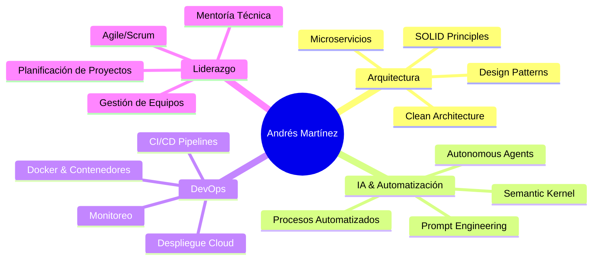

# 👋 Hola, soy Andrés Martínez

<div align="center">
  <!-- Banner de texto animado -->
  <a href="https://git.io/typing-svg">
    
  </a>
</div>

<p align="center">
  <a href="https://andresmmartinez.com" target="_blank">
    
  </a>
  <a href="mailto:andres.martinez.g@gmail.com" target="_blank">
    
  </a>
  <a href="https://linkedin.com/in/andresmartinez" target="_blank">
    
  </a>
  <a href="https://github.com/Andres-MMG" target="_blank">
    
  </a>
</p>

---

## 🚀 Sobre Mí

```typescript
const andres = {
  nombre: "Andrés Martínez Gajardo",
  ubicación: "Santiago, Chile 🇨🇱",
  rol: "Ingeniero de Software Senior / Jefe de Proyectos AI",
  experiencia: "20+ años en .NET Ecosystem y Soluciones de IA",
  habilidadesClave: [
    "Arquitectura Clean Architecture",
    "Microservicios y API REST",
    "Integración de Agentes Autónomos de IA",
    "CI/CD y DevOps con Docker, Coolify",
    "Bases de Datos: PostgreSQL, SQL Server, Redis"
  ],
  pasiones: ["Clean Architecture", "Innovación en IA", "Mentoría Técnica", "Aprendizaje Continuo"]
};
````

Soy un Ingeniero de Software Senior con más de 20 años de experiencia liderando proyectos críticos en la banca y otras industrias. Experto en arquitectura limpia (Clean Architecture), principios SOLID y diseño de sistemas escalables. Actualmente dirijo iniciativas de integración de agentes autónomos de IA, optimización de procesos y despliegues cloud-native. Me apasiona impulsar la adopción de buenas prácticas y evangelizar tecnologías emergentes.

---

## 💼 Experiencia Profesional

### 🔥 M\&L AI SpA — *Ingeniero de Software / Jefe de Proyectos AI*

*Ago 2024 – Presente* | Santiago, Chile

* 🤖 **Desarrollo de Agentes Autónomos**: Recepcionistas virtuales, asistentes de agenda y agentes inmobiliarios/servicios médicos con IA.
* ⚡ **Microservicios**: Integración .NET C# y Python con frontend en React; optimización de experiencia de usuario.
* 📦 **Stack de IA**: Retell.ai, VAPI, .NET Semantic Kernel, ChatGPT, ElevenLabs.
* 🐳 **DevOps & Cloud**: Docker, Coolify, VPS, PostgreSQL, Redis.
* 🔗 **Automatización**: n8n, Flowise, Chatwoot; prompt engineering y procesamiento semántico.

### 🏦 Sermaluc — *Ingeniero de Software / Jefe de Proyectos TI*

*Nov 2010 – Jul 2024* | Santiago, Chile

* 💻 **Banco Central**: Lideré desarrollo de la “App Regional” con .NET y Blazor WebAssembly; prototipo en .NET MAUI para estadísticas en tiempo real.
* 💳 **Banco Itaú**: Diseño e implementación de APIs REST para automatización de procesos bancarios y flujos Murex.
* 🏛️ **BancoEstado & Otros**: Proyectos críticos como Venta Crédito Hipotecario (VCH), Seguros FIDENS, Digitalización de Imágenes y Carpeta Electrónica Cliente.
* 🛠️ **DevOps**: Promoví CI/CD con GitLab, contenedorización y despliegues escalables.

### Otras Experiencias Relevantes

*1998 – 2010* | Santiago, Chile

* **Newsystems Ltda.** (2001–2007): Desarrollo y mantenimiento de plataformas ColWeb® y módulos para Escuelas de Conductores.
* **Salas Consultoría y Asociados** (2000–2001): Implementación de Digital Dashboard y Cubos OLAP para clientes como Microsoft Chile y Compaq.
* **Dos en Uno** (2000): Migración y desarrollo de mantenedores, modelamiento de datos con Power Designer.
* **Clínica Santiago** (1999–2000): Sistemas de Gestión Clínica; módulos de facturación y reportes.
* **NetPlus Gestión Informática** (1998–1999): Módulos mantenedores en Visual Basic 5.0 para proyectos gubernamentales.

---

## 🎓 Educación

* **Analista de Sistemas**
  Universidad de Ciencias de la Informática (UCINF) | 2009 – 2010

* **Técnico en Programación de Sistemas Computacionales**
  Centro Politécnico Particular Nº 2 de Ñuñoa, Santiago, Chile | 1993 – 1996

---

## 🛠️ Stack Tecnológico

### Backend & APIs

<p align="left">
  
  
  
  
</p>

### Frontend & Mobile

<p align="left">
  
  
</p>

### Bases de Datos & Cloud

<p align="left">
  
  
</p>

### IA & Automatización

<p align="left">
  
  
  
  
</p>

### DevOps & Herramientas

<p align="left">
  
  
</p>

---

## 📊 Estadísticas de GitHub

<div align="center">
  <table>
    <tr>
      <td width="50%">
        
      </td>
      <td width="50%">
        
      </td>
    </tr>
  </table>
  <br/>
  
</div>

---

## 🏆 Proyectos Destacados

<div align="center">
  <table>
    <tr>
      <td align="center" width="33%">
        🤖 **AI Virtual Agents**<br/>
        Agentes autónomos con IA<br/>
        **.NET + Python + React**<br/>
        [🔗 Demo](#)
      </td>
      <td align="center" width="33%">
        🏦 **Banking Solutions**<br/>
        APIs REST para banca<br/>
        **.NET Core + SignalR**<br/>
        [🔗 Ver más](#)
      </td>
      <td align="center" width="33%">
        📊 **Real-time Analytics**<br/>
        Dashboards en tiempo real<br/>
        **Blazor WebAssembly**<br/>
        [🔗 Portfolio](https://andresmmartinez.com)
      </td>
    </tr>
  </table>
</div>

---

## 🎯 Especialidades



---

## 📈 Impacto & Logros

* 🏆 **20+ años** de experiencia en desarrollo de software.
* 🚀 Liderazgo de equipos en proyectos **críticos del sector bancario** (Banco Central, Banco Itaú, BancoEstado).
* 🤖 Pionero en implementación de **agentes de IA autónomos** en Chile.
* 📊 Especialista en **arquitecturas escalables** y **Clean Code**.
* 🎓 Mentor técnico y **evangelista de buenas prácticas** de arquitectura.

---

## 🌱 Actualmente Aprendiendo

* 🧠 **Large Language Models** y técnicas avanzadas de prompt engineering.
* ☁️ **Cloud-native architectures** con Kubernetes.
* 🔗 **Blockchain** y tecnologías descentralizadas.
* 📱 **Desarrollo Cross-platform** con .NET MAUI.

---

## 💬 Hablemos

> “La tecnología es mejor cuando acerca a las personas” – Matt Mullenweg

¿Tienes un proyecto interesante? ¿Quieres colaborar en algo innovador? ¡Conversemos!

<div align="center">
  <a href="https://andresmmartinez.com" target="_blank">
    
  </a>
  <a href="mailto:andres.martinez.g@gmail.com" target="_blank">
    
  </a>
</div>

---

<div align="center">
  
</div>

<div align="center">
  *"Construyendo el futuro, una línea de código a la vez"* 💻✨
</div>
